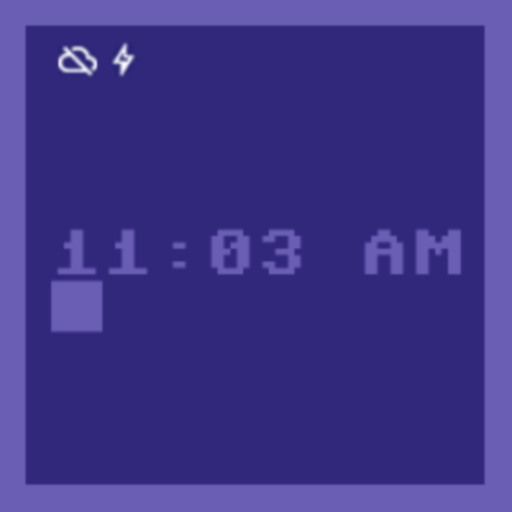

### Welcome to C64 Tribute Watchface

This watchface for WearOS by Google depicts the legendary colors of the Commodore 64 as well as its iconic font. Based on system settings time is shown in 12 or 24 hour format. You can also run the app on your phone or tablet. 

C64 Tribute Watchface is published under the terms of the [GNU General Public License Version 3](./gpl-3.0.txt). The font is used in accordance with the license provided by its publishers in [license.txt](./license.txt). The first version of this app (well, actually, its source code) appeared 2015 in the third edition of my book about Android development called *Android 5*.
